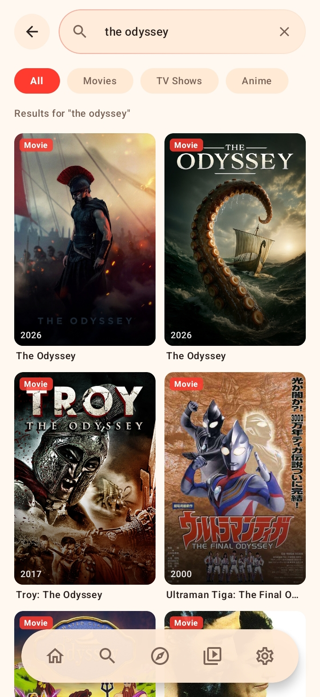
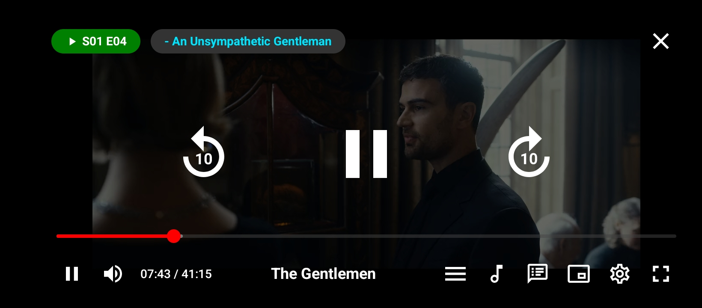
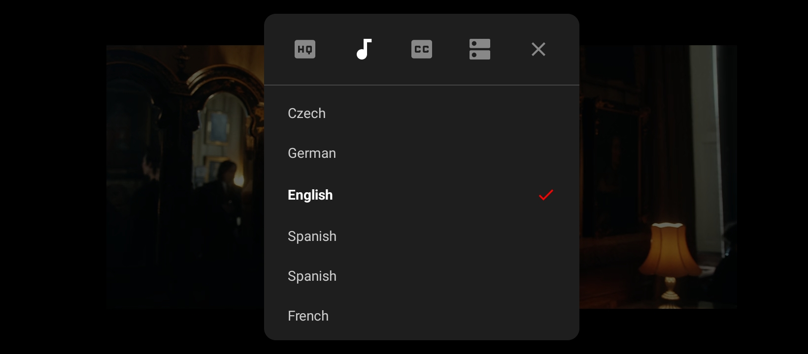
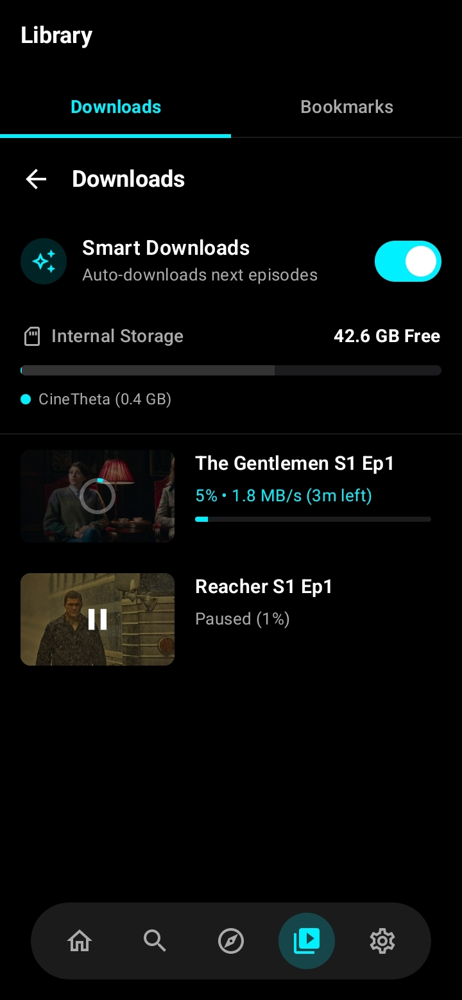
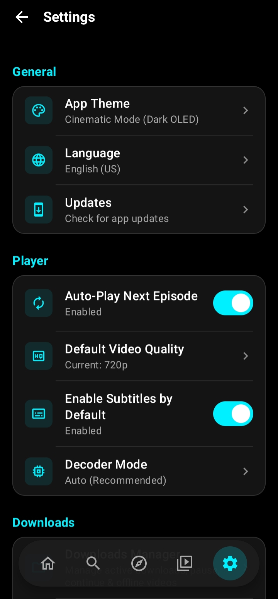

<p align="center">
  
</p>

<h1 align="center">CineTheta</h1>

<p align="center">
  <strong>A sleek, high-performance, multi-provider video streaming & downloading app for Android.</strong><br>
  <em>100% Native Jetpack Compose • Zero In-Video Ads • Offline Downloads • 120Hz Fluid UI</em>
</p>

<p align="center">
  <a href="https://cinetheta.github.io"></a>
  <a href="./app/SineTheta-v1.0.4.apk"></a>
  <a href="#-release-archive--downloads"></a>
  <a href="#-system-requirements"></a>
</p>

---


## 📝 Changelog v1.0.4
- **HDHub4u Fixes:** Subtitles now correctly load via HubCloud/VidStack track extraction.
- **NetMirror Improvements:** Implemented silent background pre-warming for Cloudflare verification. No more 37-second waits when clicking a movie!
- **Smooth Plugin Switcher:** Removed hard app reloads. Changing plugins now smoothly refreshes the UI without a black screen.
- **Home Screen Overhaul:** 
  - Added *Pakistani TV Shows (Use MovieBox)*
  - Filtered *Indian Web Series* to strictly exclude daily TV soaps
  - Added *USA Series*, *English Series*, and *English Movies* sections.
- **Anime Renames:** Rebranded internal anime plugins to *Animedekho* and *Toonstream*.

## 🌐 Overview

**CineTheta** is a modern, privacy-focused open streaming client engineered specifically for Android. Built from the ground up using **Kotlin** and **Jetpack Compose**, it offers a buttery-smooth 120Hz native experience without the bloat of web wrappers or heavy cross-platform frameworks.

This repository serves as the official host for the [CineTheta Website](https://cinetheta.github.io) and direct APK release distribution channels.

### 🚀 Key Highlights

- ⚡ **Multi-Provider Stream Resolvers**: Automatically queries high-speed video backends (NetMirror, Prime, HDHub4u, ToonStream, AnimeDekho) with auto-failover and quota protection.
- 🛡️ **Zero Ad Interruptions During Playback**: Zero pre-roll ads, zero mid-rolls, and zero banner overlays while watching media.
- 📥 **Background Download Engine**: Download complete movies and TV episodes directly to your local storage (`Downloads/CineTheta`) with auto-resume support.
- 🎬 **Next-Gen Video Player**: Built on AndroidX Media3 (ExoPlayer) and VLC FFmpeg decoders with hardware acceleration, Picture-in-Picture (PiP), multi-audio track switching, and subtitle selectors.
- 🌐 **Built-in DNS-over-HTTPS (DoH)**: Integrated Cloudflare & Google secure DNS resolvers to bypass ISP domain throttling and ensure reliable stream connectivity.
- 🎨 **Fluid Jetpack Compose UI**: Native Material 3 interface featuring dynamic Dark/Light themes, responsive typography, and fluid touch physics.

---

## 📸 Screenshots Showcase

<table align="center">
  <tr>
    <td align="center"><b>Home Dashboard (Dark)</b></td>
    <td align="center"><b>Home Dashboard (Light)</b></td>
  </tr>
  <tr>
    <td></td>
    <td></td>
  </tr>
  <tr>
    <td align="center"><b>Media Details & Seasons</b></td>
    <td align="center"><b>Multi-Source Search</b></td>
  </tr>
  <tr>
    <td></td>
    <td></td>
  </tr>
  <tr>
    <td align="center"><b>Advanced Player Interface</b></td>
    <td align="center"><b>Multi-Audio & Subtitles Track Selection</b></td>
  </tr>
  <tr>
    <td></td>
    <td></td>
  </tr>
  <tr>
    <td align="center"><b>Offline Download Manager</b></td>
    <td align="center"><b>Settings & Encrypted DoH</b></td>
  </tr>
  <tr>
    <td></td>
    <td></td>
  </tr>
</table>

---

## 📦 Release Archive & Downloads

All release builds are cryptographically signed, production-ready release APKs.

| Version | Release Date | Build | APK File | Direct Download | CDN Mirror |
| :--- | :--- | :---: | :---: | :---: | :---: |
| 🟢 **v1.0.3** *(Latest)* | Sep 23, 2026 | `8` | `~17.5 MB` | [📥 Download v1.0.3](./app/SineTheta-v1.0.4.apk) | [GitHub CDN](https://github.com/cinetheta/cinetheta.github.io/releases/download/v1.0.3/SineTheta-v1.0.4.apk) |
| ⚪ **v1.0.2** | Sep 22, 2026 | `7` | `~17.5 MB` | [📥 Download v1.0.2](./app/CineTheta-v1.0.2.apk) | [GitHub CDN](https://github.com/cinetheta/cinetheta.github.io/releases/download/v1.0.2/CineTheta-v1.0.2.apk) |
| ⚪ **v1.0.1** | Sep 20, 2026 | `6` | `~17.4 MB` | [📥 Download v1.0.1](./app/CineTheta-v1.0.1.apk) | [GitHub CDN](https://github.com/cinetheta/cinetheta.github.io/releases/download/v.1.0.1/CineTheta-v1.0.1.apk) |
| ⚪ **v1.0.0** | Sep 19, 2026 | `5` | `~17.4 MB` | [📥 Download v1.0.0](./app/CineTheta-v1.0.0.apk) | [GitHub CDN](https://github.com/cinetheta/cinetheta.github.io/releases/download/v1.0.0/CineTheta-v1.0.0.apk) |

> [!TIP]
> For complete detailed technical changelogs for each build, please view [RELEASE_NOTES.md](RELEASE_NOTES.md).

---

## 📱 System Requirements

- **Operating System**: Android 7.0 (Nougat, API Level 24) or higher.
- **Recommended**: Android 10+ with 120Hz display refresh support.
- **Architecture**: ARM64-v8a, ARMeabi-v7a, x86_64.
- **Storage**: ~25 MB free internal storage for installation + additional space for offline video downloads.

---

## 📥 How to Install

1. **Download APK**: Tap the direct download link for the latest [SineTheta-v1.0.4.apk](./app/SineTheta-v1.0.4.apk).
2. **Enable Unknown Sources**: If prompted by Android, permit your browser to install unknown apps (*Settings → Apps → Special access → Install unknown apps*).
3. **Install & Launch**: Tap the downloaded file in your notification shade or file manager, confirm installation, and launch CineTheta!

---

## 📁 Repository Structure

```
cinetheta/
├── app/
│   ├── SineTheta-v1.0.4.apk   # Current latest stable APK (Build 8)
│   ├── CineTheta-v1.0.2.apk   # Previous release APK (Build 7)
│   ├── CineTheta-v1.0.1.apk   # Older release APK (Build 6)
│   └── CineTheta-v1.0.0.apk   # Initial release APK (Build 5)
├── Screenshots/               # Full UI & feature screenshot gallery
├── index.html                 # Official CineTheta landing page & distribution portal
├── logo.png                   # Brand icon & identity graphic
├── RELEASE_NOTES.md           # Comprehensive release changelogs
└── README.md                  # Project overview & documentation
```

---

## 💖 Support CineTheta Development

CineTheta is free and open to the community. Your contributions directly cover server bandwidth, API scrapers, and ongoing updates:

| Method | Address / ID | Details |
| :--- | :--- | :--- |
| 🟡 **Binance Pay** | `1041683310` | Instant transfer, 0% fees |
| 🟢 **USDT (TRC-20)** | `TJEbUfurBzdNhFARk6STdzNKAKpuQR5g6j` | Tron Network |
| 🎬 **Free Contribution** | [Browse Sponsor Page](https://ensueddenied.com/jg7gcgvu?key=a0919ba886af754e302a4630d7efcf1f) | 100% free — browsing our sponsor for 20s+ directly helps cover server costs |

---

## ⚖️ Legal Disclaimer

**CineTheta** is purely a client-side media search and indexing interface. It does not host, upload, or store any audio or video content on its servers. All media streamed through the application is aggregated from publicly accessible third-party providers on the open web. The developers of CineTheta hold no affiliation with these providers and accept no liability for any content retrieved. Please ensure your use of this software complies with your local copyright and intellectual property laws.

---

<p align="center">
  <sub>Built with ❤️ for the open entertainment community.</sub>
</p>
